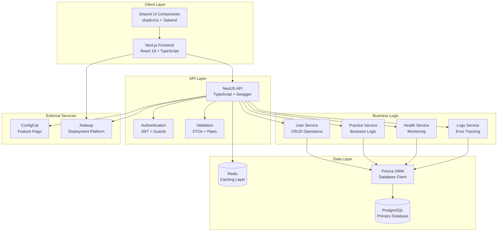
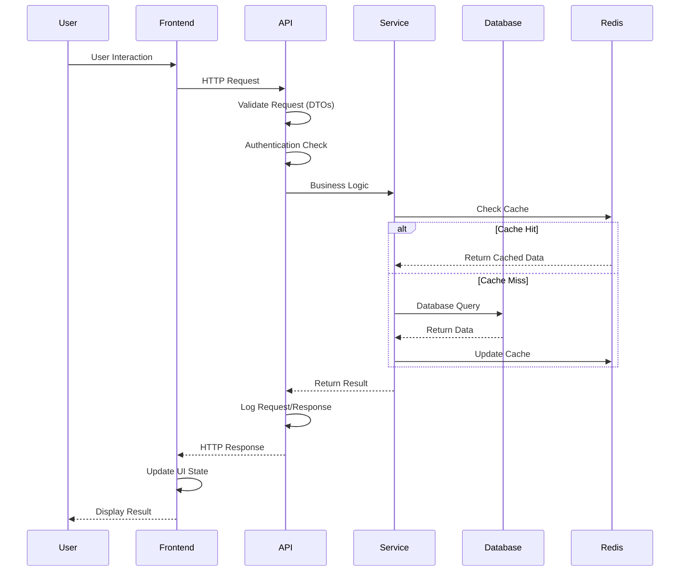
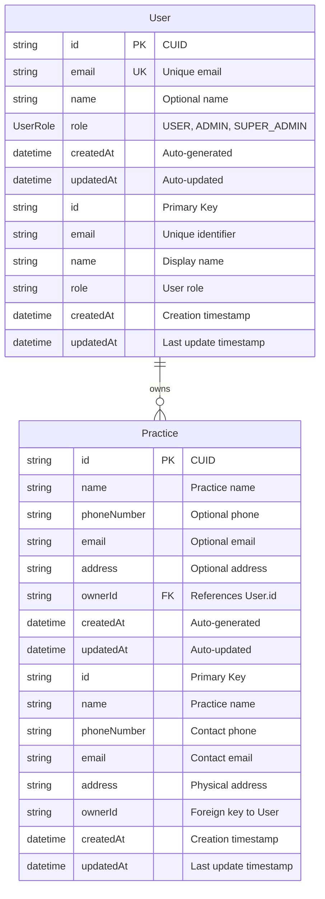
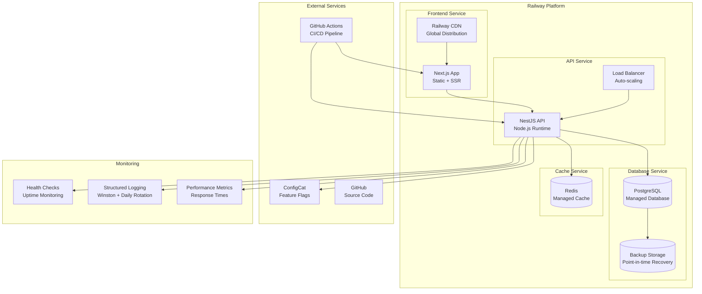
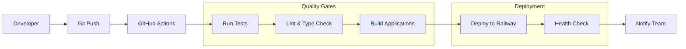

# ProntoPlus Architecture

## Overview

ProntoPlus is a monorepo built with Turborepo, containing a Next.js frontend and NestJS API for an AI receptionist solution targeting orthodontic practices.

## Technology Stack

### Frontend
- **Framework**: Next.js 15 with App Router
- **React**: React 19
- **Language**: TypeScript (strict mode)
- **Styling**: Tailwind CSS
- **Components**: shadcn/ui
- **Testing**: Jest + React Testing Library

### Backend
- **Framework**: NestJS
- **Language**: TypeScript (strict mode)
- **Database**: PostgreSQL with Prisma ORM
- **Documentation**: Swagger/OpenAPI
- **Testing**: Jest + Supertest

### Monorepo
- **Manager**: Turborepo
- **Package Manager**: pnpm workspaces
- **Linting**: ESLint with shared configs
- **Formatting**: Prettier
- **Type Checking**: TypeScript with shared configs

## Architecture Patterns

### Monorepo Structure
```
/
├── apps/           # Applications
├── packages/       # Shared libraries
├── docs/          # Documentation
└── config files   # Root configuration
```

### Shared Packages
- **@prontoplus/ui**: Reusable React components
- **@prontoplus/tsconfig**: TypeScript configurations
- **@prontoplus/eslint-config**: ESLint configurations

### API Design
- **RESTful**: Standard HTTP methods and status codes
- **Modular**: Feature-based module organization
- **Documented**: Swagger/OpenAPI documentation
- **Validated**: Request/response validation with DTOs

### Frontend Design
- **Component-based**: Reusable UI components
- **Type-safe**: Full TypeScript coverage
- **Responsive**: Mobile-first design with Tailwind
- **Accessible**: ARIA-compliant components

## System Architecture

### High-Level Architecture



## Data Flow

### Request/Response Lifecycle



### Frontend → API
1. User interaction triggers API call
2. Request validated by DTOs
3. Business logic processed
4. Database operations via Prisma
5. Response returned to frontend

### Shared State
- **UI Components**: Shared via @prontoplus/ui package
- **Type Definitions**: Shared via TypeScript configs
- **Linting Rules**: Shared via ESLint configs

## Database Schema

### Entity Relationship Diagram



### Database Design Principles

- **CUID Primary Keys**: Using CUID for better performance and security
- **Soft Relationships**: Practices reference users but can exist independently
- **Audit Trail**: Created/updated timestamps on all entities
- **Flexible Schema**: Optional fields for gradual data collection
- **Indexing Strategy**: Indexes on foreign keys and frequently queried fields

## Development Workflow

### Local Development
1. `pnpm install` - Install all dependencies
2. `pnpm dev` - Start all services
3. Frontend: http://localhost:3000
4. API: http://localhost:4000
5. API Docs: http://localhost:4000/api/docs

### Build Process
1. `pnpm build` - Build all packages
2. TypeScript compilation
3. Next.js production build
4. NestJS compilation
5. Shared package compilation

### Testing Strategy
- **Unit Tests**: Individual component/function testing
- **Integration Tests**: API endpoint testing
- **E2E Tests**: Full user flow testing
- **Type Tests**: TypeScript compilation verification

## Deployment Considerations

### Frontend
- Static export capability
- CDN-friendly assets
- Environment-based configuration

### API
- Container-ready
- Database migrations
- Health check endpoints
- Environment-based configuration

### Shared Packages
- Versioned releases
- Backward compatibility
- Dependency management

## Security

### API Security
- Input validation
- CORS configuration
- Environment variable protection
- Database connection security

### Frontend Security
- XSS prevention
- CSRF protection
- Secure API communication
- Environment variable protection

## Performance

### Frontend Performance
- Code splitting
- Image optimization
- Bundle analysis
- Caching strategies

### API Performance
- Database query optimization
- Response caching
- Connection pooling
- Monitoring and logging

## Scalability

### Horizontal Scaling
- Stateless API design
- Database connection pooling
- CDN integration
- Load balancer ready

### Vertical Scaling
- Efficient resource usage
- Memory optimization
- CPU optimization
- Database indexing

## Deployment Architecture

### Production Deployment



### CI/CD Pipeline



## Monitoring

### Application Monitoring
- Health check endpoints
- Error tracking
- Performance metrics
- User analytics

### Infrastructure Monitoring
- Database performance
- API response times
- Error rates
- Resource utilization
